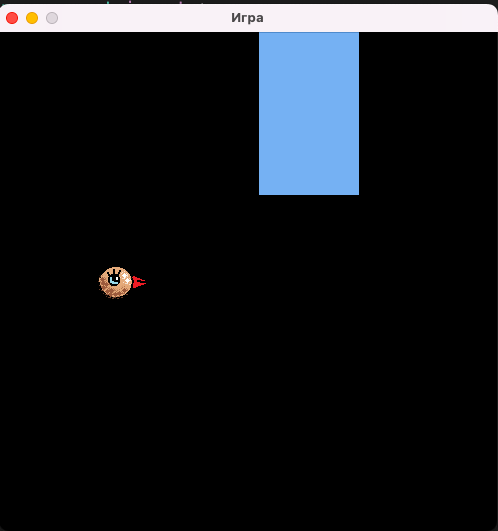
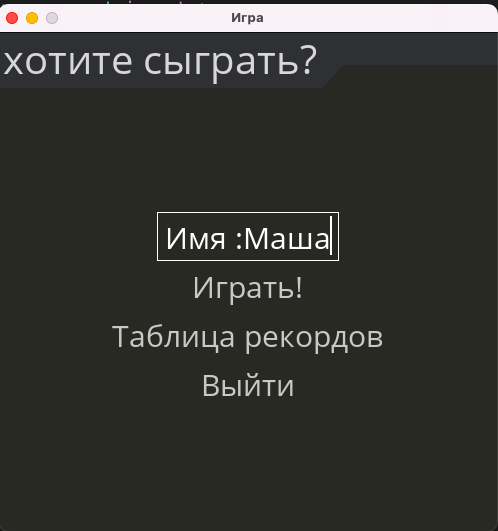
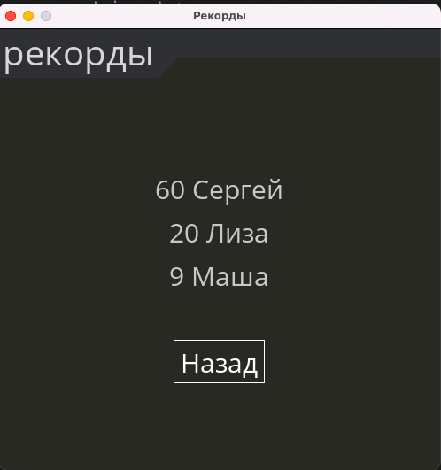

# game_python
## Игра "Птичка"
#### *основная идея игры: птичка, которая летает между прямоугольниками (прямоугольники называем clouds).*

#### *Цель - пролететь как можно дальше, не врезаясь в прямоугольники.*

#### Игра запускается посредством запуска файла main.py в терминале, находясь в соответствующей директории:

      python3 main.py

#### Изначально открывется окно меню, с опциями:

* посмотреть рекордсменов
* вписать свое имя
* играть
* выйти

#### Eсли перейти в таблицу рекордов, то можно увидеть имена топ-3 реордсменов.

***управлять птичкой в игре можно нажатием стрелочек (вверх и вниз), клавиши можно зажимать надолго.***

## присутствуют следующие файлы:

1) Для непосредственого запуска игры
[main.py](./main.py)

2) Файл с функциями птицы [bird_part.py](./src/bird_part.py)

3) Файл для обработки нажатия клавиш игроком [button.py](./src/button.py)

4) Файл с функциями облаков[cloud_part.py](./src/cloud_part.py)

5) Файл с функциями меню, таблицы рекордов и run [run_part.py](./src/run_part.py)

6) Файл с именами игроков и данными об их успехах [data.txt](./data/data.txt)

7) Файлы с картинками
    
    * [birdik.png](./images/birdik.png)
    * [game_over.png](./images/game_over.png)

8) Звуковые файлы

    * [birds_song.mp3](./music/birds_song.mp3)

    * [game_over_sound.mp3](./music/game_over_sound.mp3)

    * [menu_sound.mp3](./music/menu_sound.mp3)

    * [luck_song.mp3](./music/luck_song.mp3)

9) [reqirements.txt](./requirements.txt)

10) Данный файл README.md и картинки для него.

*Примечания*
* Птица не может вылетать за пределы экрана
* После выхода прямоугольника за экран объект прямоугольника удаляется
* Со временем птица летит быстрее
* При выходе из игры и повторном запуске, таблица рекордов обновляется, если рекорд был побит, и остается прежней, если этого не произошло
